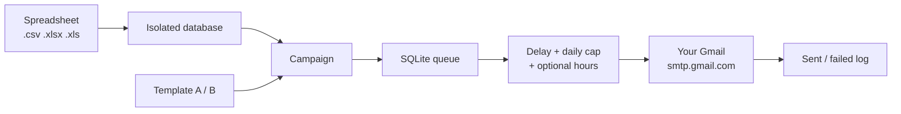

<p align="center">
  
</p>

<p align="center">
  <strong>A private outreach desk that lives on your computer and sends through your own Gmail.</strong><br/>
  Import a spreadsheet, write one template, and let a paced queue send a personal note to each row.
</p>

<p align="center">
  
  
  
  
  
</p>

<p align="center">
  
  
  
  
  
  
</p>

---

StrokeCRM is a self-hosted cold-email workspace for founders and small teams. There is no cloud account, no monthly seat fee, and no copy of your leads on someone else's server. The app runs at `localhost`, stores everything in a SQLite file, and hands each message to Gmail over SMTP with an App Password.

Commercial tools rent you the same loop: upload contacts, merge fields, wait between sends, and hope the vendor does not get your domain restricted. StrokeCRM keeps that loop, and leaves the data with you.

## What you can do

| | | |
| :--- | :--- | :--- |
| **Campaign cockpit** | One campaign binds one database and one template. Start, pause, stop, and watch the next send count down. | `Campaigns` |
| **Human pacing** | Random delay between messages, a daily cap, and an optional working-hours window. | `Settings` |
| **Live personalization** | `{{Column}}` tags, with a fallback when a cell is empty: `{{FirstName \| "there"}}`. | `Templates` |
| **Spam radar** | Subject and body are scored against a list of cold-email trigger phrases before you launch. | `Templates` |
| **A/B split** | Half the rows get variant A, half get variant B. Compare the two from the A/B studio. | `A/B Testing` |
| **CC and BCC** | Optional addresses copied on every message in a campaign, including the test preview. | `Campaigns` |
| **Preflight** | A launch check for sender, template, database, spam score, and remaining daily quota. | `Campaigns` |
| **Audit trail** | Every attempt is logged. Export the log as CSV from the dashboard. | `Dashboard` |

## How a send actually moves



Each row is claimed once. If you close the app mid-send, the next boot puts stuck `SENDING` rows back to `PENDING` and pauses a campaign that was `RUNNING`, so a restart does not double-send.

## Quick start

You need [Node.js](https://nodejs.org/) 20 or newer, and a Gmail account that can create an App Password.

```bash
git clone https://github.com/Prashant1873/StrokeCRM.git
cd StrokeCRM
npm install
npm install --prefix client
npm run dev
```

Then open [http://localhost:5173](http://localhost:5173).

| Process | Address | Role |
| :--- | :--- | :--- |
| Vite UI | `http://localhost:5173` | The app you click through |
| Express API | `http://localhost:3001` | Queue, SQLite, and SMTP |
| Dev proxy | `/api` → port `3001` | The UI never talks to Gmail directly |

`npm run server` and `npm run client` start the two halves on their own. `npm run build` writes a production UI into `client/dist`.

## Connect Gmail

Sending uses a Google App Password, not your normal login password.

1. Turn on 2-Step Verification for the Google account.
2. Create an App Password at [myaccount.google.com/apppasswords](https://myaccount.google.com/apppasswords).
3. In StrokeCRM open **Settings & Gmail**, choose **Google App Password**, and run **Test Connection**.
4. Pick a quota profile. Personal `@gmail.com` is treated as **500 sends/day**. Google Workspace is treated as **2,000/day**. Those are Google's limits, not a StrokeCRM upsell.

Settings can also store an OAuth client id, secret, and refresh token. The live sender still dispatches through SMTP with the App Password. Do not paste those secrets into git. `.env` and the SQLite file are ignored.

## A normal afternoon

The sidebar is numbered **1** through **6**. Escape steps back when there is a parent screen.

1. **Databases.** Drop in `.csv`, `.xlsx`, or `.xls` (up to 15 MB). Confirm which column is the email. The sheet is copied into `data/databases/` and is not part of this git repo.
2. **Templates.** Write subject and body. Click a column pill to insert a tag. Cycle the preview across the first rows. Watch the spam score move as you type.
3. **Campaigns.** Create a campaign and bind that database and template. A database belongs to one campaign at a time.
4. **Optional copy.** Add CC or BCC addresses, separated by commas. Save. Blank fields mean the lead is the only recipient. The lead's own address is dropped from CC/BCC if you also listed it there.
5. **Test.** Send one preview to your inbox. If CC/BCC is saved, that preview includes them too.
6. **Preflight, then start.** The worker waits a random gap (default 45–90 seconds) between messages and stops when the daily cap or the contact list is finished.

Pause keeps your place. Stop ends the run. Deleting a campaign releases its database so another campaign can use it. You cannot delete a campaign while it is `RUNNING`.

### Merge tags

Tags are case-insensitive and ignore punctuation, so `{{First Name}}` and `{{firstname}}` can hit the same column.

```text
Subject: Quick note for {{Company | "your team"}}

Hi {{FirstName | "there"}},

I saw what {{Company}} is doing and had one question.
```

If `FirstName` is empty, the recipient sees `there`.

### CC / BCC

Saved on the campaign, not on the template. The queue reloads the campaign before each message, so a save applies to the next send without a restart.

| Input | What gets stored |
| :--- | :--- |
| `a@firm.com, A@firm.com; ops@firm.com` | `a@firm.com, ops@firm.com` |
| `not-an-email` | Rejected. Nothing is saved. |
| empty | Cleared. Later mail goes to the lead only. |

## What stays on disk

| Path | What it is | In git? |
| :--- | :--- | :--- |
| `data/strokecrm.db` | Accounts, campaigns, queue, logs | No |
| `data/databases/` | The spreadsheets you imported | No |
| `.env` | Optional local overrides | No |

Gmail credentials sit in that SQLite file. Back it up if you care about the history. Do not commit it.

## Layout

```text
StrokeCRM/
├── server/            Express API, SQLite, SMTP queue
│   ├── index.js       Routes
│   ├── db.js          Schema and migrations
│   ├── queueService.js
│   ├── authService.js
│   ├── databaseService.js
│   └── templateService.js
├── client/            React + Vite + Tailwind
│   └── src/components
├── data/              Created at runtime. Private.
└── neural_map.md      Short map of how the pieces connect
```

## Scripts

| Command | What it does |
| :--- | :--- |
| `npm run dev` | API and UI together |
| `npm run server` | API on port `3001` (`PORT` overrides it) |
| `npm run client` | UI on port `5173` |
| `npm run build` | Production frontend build |

## Stack

React 19 and Tailwind 4 on Vite. Express 5, `better-sqlite3`, Nodemailer, and `xlsx` on the server. Charts on the dashboard use Recharts.

## Limits worth knowing

- One active Gmail sender at a time.
- Personal Gmail is capped by Google at about 500 messages a day. Workspace is about 2,000. The dashboard gauge follows the profile you pick.
- CC and BCC recipients count toward that same Gmail quota.
- The queue is single-file SQLite. Run one StrokeCRM process against `data/strokecrm.db`.
- This is a local tool for mail you are allowed to send. It does not buy lists, hide the sender, or bypass Gmail's limits.

## License

MIT. See `package.json`.
